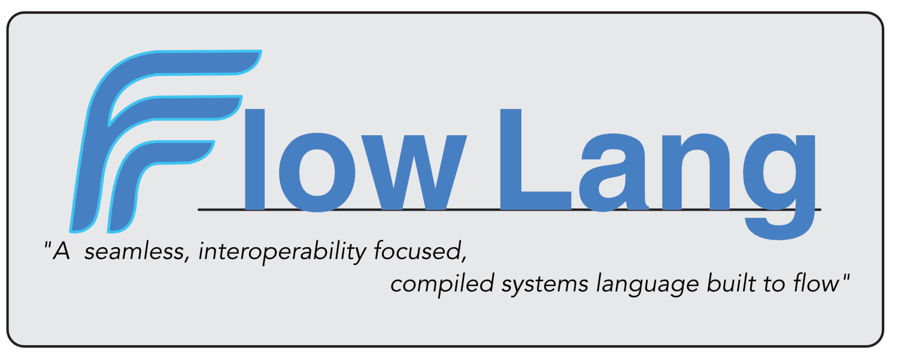

<div align="center">



# Flow Programming Language

### *Write once, run anywhere, interoperate with everything*

[](https://github.com/theDevJade/Flow/actions/workflows/ci.yml)
[](https://github.com/theDevJade/Flow/releases)
[](LICENSE)

**Built With:**

[](https://isocpp.org/)
[](https://llvm.org/)
[](https://www.rust-lang.org/)
[](https://go.dev/)
[](https://www.typescriptlang.org/)
[](https://svelte.dev/)
[](https://nodejs.org/)
[](https://cmake.org/)
[](https://gradle.org/)
[](https://www.docker.com/)

**Flow** is a modern, statically-typed systems programming language that combines native performance with seamless interoperability. Built on LLVM, Flow compiles to optimized machine code while providing elegant syntax, powerful tooling, and first-class integration with C and Java.

<p align="center">
  <a href="#-key-features">Features</a> •
  <a href="#-quick-start">Quick Start</a> •
  <a href="#-installation">Installation</a> •
  <a href="#-documentation">Documentation</a> •
  <a href="#-ecosystem">Ecosystem</a> •
  <a href="#-contributing">Contributing</a>
</p>

</div>

---

## ✨ Key Features

<table>
<tr>
<td width="50%">

### 🚀 **Native Performance**
Compiles directly to optimized machine code via LLVM. No runtime overhead, no garbage collection delays—just raw, efficient execution.

### 🔗 **Seamless Interop**
Call C functions natively with `link` blocks. Full JNI bindings for Java integration. Export Flow functions for use in other languages.

### 📦 **River Package Manager**
Modern dependency management inspired by Cargo. Create, build, publish, and share packages effortlessly.

</td>
<td width="50%">

### 🛠️ **Excellent Tooling**
VSCode extension with full LSP support. Code completion, diagnostics, go-to-definition, and more—all out of the box.

### 🔒 **Memory Safety**
Immutability by default with explicit `mut` keyword. Optional types prevent null pointer errors at compile time.

### 📚 **Rich Type System**
Structs, optional types, type inference, and strong static typing keep your code safe without sacrificing expressiveness.

</td>
</tr>
</table>

---

## 🎯 Quick Start

### Hello World

```flow
func main() {
    print("Hello, Flow!");
}
```

<details>
<summary><b>📖 More Examples</b></summary>

### Variables & Types

```flow
func main() {
    let x: int = 10;           // Immutable by default
    let mut y: int = 20;       // Explicit mutability
    
    y = y + x;
    print("Result: " + y);     // Output: 30
}
```

### Functions

```flow
func add(a: int, b: int) -> int {
    return a + b;
}

func main() {
    let result: int = add(5, 3);
    print("5 + 3 = " + result);
}
```

### C Interoperability

```flow
link "c" {
    func sqrt(x: float) -> float;
    func pow(x: float, y: float) -> float;
}

func main() {
    let root: float = sqrt(16.0);
    let power: float = pow(2.0, 10.0);
    
    print("sqrt(16) = " + root);      // 4.0
    print("pow(2, 10) = " + power);   // 1024.0
}
```

### Structs

```flow
struct Point {
    float x;
    float y;
}

func main() {
    let p: Point = { x: 10.0, y: 20.0 };
    print("Point: (" + p.x + ", " + p.y + ")");
}
```

### Optional Types

```flow
func find_user(id: int) -> int? {
    if (id == 1) return 42;
    return null;
}

func main() {
    let maybe: int? = find_user(1);
    let nothing: int? = find_user(999);
}
```

</details>

---

## 🔧 Installation

### Quick Install with Lake (Recommended)

**Lake** is our rustup-style toolchain installer that handles everything automatically:

```bash
curl --proto '=https' --tlsv1.2 -sSf https://install.flowc.dev/init | sh
```

<details>
<summary><b>🔨 Manual Installation</b></summary>

### Prerequisites

- **C++ compiler** (Clang 10+ or GCC 9+)
- **LLVM 18+** with development libraries
- **CMake 3.20+**
- **Rust** (for River package manager)
- *Optional:* JDK 11+ (for Java bindings)
- *Optional:* Node.js 14+ (for VSCode extension)

### macOS

```bash
# Install dependencies
brew install llvm cmake rust

# Set LLVM path
export LLVM_DIR=/opt/homebrew/opt/llvm/lib/cmake/llvm
```

### Linux (Ubuntu/Debian)

```bash
# Install dependencies
sudo apt-get install build-essential cmake llvm-18-dev clang-18
curl --proto '=https' --tlsv1.2 -sSf https://sh.rustup.rs | sh
```

### Windows

```powershell
# Install dependencies via Chocolatey
choco install llvm cmake rust
```

### Building from Source

```bash
# 1. Build Flow Compiler
cd flowbase
./build.sh

# 2. Build River Package Manager
cd ../river
cargo build --release

# 3. Install VSCode Extension (Optional)
cd ../flowvscode
npm install && npm run compile
code --install-extension flow-lang-0.1.0.vsix
```

</details>

---

## 📦 Ecosystem

<div align="center">

| Component | Description | Status |
|:---------:|:------------|:------:|
| **[flowbase](flowbase/)** | Core compiler, runtime, and LSP server | ✅ Complete |
| **[river](river/)** | Package manager for dependencies | ✅ Complete |
| **[flowvscode](flowvscode/)** | Official VSCode extension | ✅ Complete |
| **[javabindings](javabindings/)** | JNI bindings for Java integration | ✅ Complete |
| **[registry-server](registry-server/)** | Package registry backend | ✅ Complete |
| **[frontend](frontend/)** | Web frontend and documentation (SOON) | ✅ Complete |

</div>

### 🎨 Flow Compiler (`flowbase/`)

The heart of Flow—a complete compiler toolchain built with C++17 and LLVM.

**Features:**
- Full lexer, parser, semantic analyzer, and code generator
- LLVM-based optimization and native code generation
- Language Server Protocol (LSP) for editor integration
- 10/10 example programs working perfectly

[**→ View Compiler Documentation**](flowbase/README.md)

### 🌊 River Package Manager (`river/`)

Flow's official package manager, written in Rust, inspired by Cargo.

**Commands:**
```bash
river init my-app --kind bin    # Create new binary package
river add mathlib               # Add dependency
river build                     # Build project
river publish                   # Publish to registry
```

**Package Types:**
- **Binary (`bin`)** - Executable applications with `main()`
- **Library (`lib`)** - Reusable code for other packages

[**→ View River Documentation**](river/README.md)

### 🎨 VSCode Extension (`flowvscode/`)

DIY-grade IDE support with full LSP integration.

**Features:**
- ✅ Syntax highlighting
- ✅ Code completion
- ✅ Go to definition & find references
- ✅ Hover documentation
- ✅ Error diagnostics
- ✅ Bracket matching & auto-indent

[**→ Install from Marketplace**](flowvscode/)

### ☕ Java Bindings (`javabindings/`)

Embed Flow code directly in Java applications via JNI.

```java
import com.flowlang.bindings.*;

public class Example {
    public static void main(String[] args) {
        try (FlowRuntime runtime = new FlowRuntime()) {
            String code = 
                "func multiply(a: int, b: int) -> int {\n" +
                "    return a * b;\n" +
                "}";
            
            FlowModule module = runtime.compile(code, "math");
            FlowValue result = module.call(
                runtime, "multiply",
                runtime.createInt(6),
                runtime.createInt(7)
            );
            
            System.out.println("Result: " + result.asInt());  // 42
        }
    }
}
```

[**→ View Java API Documentation**](javabindings/README.md)

---

## 🎯 Using River Package Manager

### Create a New Package

```bash
# Create an executable
river init my-app --kind bin

# Create a library
river init my-lib --kind lib
```

### Manage Dependencies

```bash
# Add a dependency
river add http --version "2.0.0"

# Build the package
river build

# Run your binary
./target/debug/my-app

# Publish to registry
river publish
```

### Example Project Structure

```
my-app/
├── River.toml          # Package manifest
├── src/
│   └── main.flow       # Your code
└── target/             # Build artifacts
    └── debug/
        └── my-app
```

---

## 📚 Documentation

### Core Resources

<table>
<tr>
<td width="50%">

**Getting Started**
- [Language Tutorial](#) *(coming soon)*
- [Example Programs](flowbase/examples/)
- [Language Reference](#) *(coming soon)*
- [API Documentation](#) *(coming soon)*

</td>
<td width="50%">

**Ecosystem Guides**
- [Compiler Architecture](flowbase/README.md)
- [River Package Manager](river/README.md)
- [Java Integration](javabindings/README.md)
- [VSCode Extension](flowvscode/README.md)

</td>
</tr>
</table>

---

## 🚦 Running Examples

```bash
# Navigate to the compiler
cd flowbase

# Run example programs
./build/flowbase examples/hello.flow
./build/flowbase examples/variables.flow
./build/flowbase examples/functions.flow
./build/flowbase examples/structs.flow
./build/flowbase examples/c_interop_test.flow
./build/flowbase examples/for_loops.flow

# Or run the complete test suite
cd ..
./TEST_ALL.sh
```

---

## 📊 Project Status

| Component | Status | Progress | Notes |
|-----------|--------|----------|-------|
| Compiler | ✅ Complete | 100% | All 10 examples working |
| LLVM Codegen | ✅ Complete | 100% | Full type support |
| JIT/AOT Engine | ✅ Working | 100% | Native execution |
| Language Server | ✅ Complete | 100% | All LSP features |
| VSCode Extension | ✅ Complete | 100% | Full integration |
| Java Bindings | ✅ Complete | 100% | 5/5 tests passing |
| River Package Manager | ✅ Complete | 100% | 10 commands implemented |
| Registry Server | ✅ Complete | 100% | REST API ready |
| Documentation | 🚧 In Progress | 60% | Expanding tutorials |

---

## 🤝 Contributing

We welcome contributions! Here's how you can help:

<table>
<tr>
<td width="33%">

### 🎨 **Language Features**
- Generics system
- Closures & lambdas
- Async/await
- Pattern matching

</td>
<td width="33%">

### 📚 **Documentation**
- Tutorials & guides
- API documentation
- Video walkthroughs
- Translation (i18n)

</td>
<td width="33%">

### 🛠️ **Tooling**
- Editor plugins
- Debugger support
- Performance profiler
- Build optimizations

</td>
</tr>
</table>

### Getting Started with Development

1. **Fork** the repository
2. **Clone** your fork: `git clone https://github.com/YOUR_USERNAME/Flow.git`
3. **Create** a feature branch: `git checkout -b feature/amazing-feature`
4. **Make** your changes
5. **Test** your changes: `./TEST_ALL.sh`
6. **Commit** with clear messages: `git commit -m 'Add amazing feature'`
7. **Push** to your fork: `git push origin feature/amazing-feature`
8. **Open** a Pull Request

---

## 🎯 Roadmap

- [x] Core compiler with LLVM backend
- [x] Package manager (River)
- [x] VSCode extension with LSP
- [x] Java bindings via JNI
- [x] C interoperability
- [ ] Generics system
- [ ] Standard library expansion
- [ ] Async/await support
- [ ] Pattern matching
- [ ] WebAssembly target
- [ ] Incremental compilation

---

## 📄 License

This project is licensed under the **MIT License** - see the [LICENSE](LICENSE) file for details.

---

## 🙏 Acknowledgments

Flow is built with and inspired by amazing open-source projects:

<div align="center">

[](https://llvm.org/)
[](https://www.rust-lang.org/)
[](https://code.visualstudio.com/)

</div>

---

## 🔗 Links

<div align="center">

[](https://github.com/theDevJade/Flow)
[](https://github.com/theDevJade/Flow/issues)
[](https://github.com/theDevJade/Flow/discussions)

</div>

---

<div align="center">

### Made with ❤️ by the Flow community (You can join!)

**Star ⭐ this repo if you find it useful!**

[](https://github.com/theDevJade/Flow/stargazers)
[](https://github.com/theDevJade/Flow/network/members)

</div>
